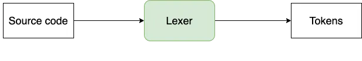
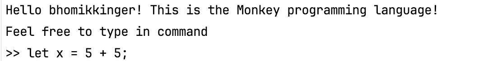
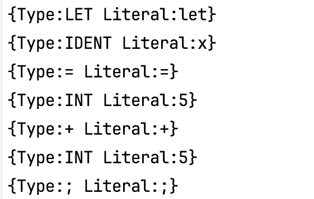
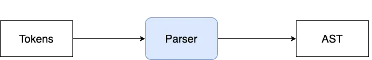

## The Monkey Programming Language & Interpreter

### Introduction


In this project, we will learn how to build an interpreter from scratch. This exercise is invaluable for gaining insight into how programming languages function under the hood and provides a solid foundation for creating your own programming language. We are going to achieve this by reading this amazing book written by Thorsten ball - https://interpreterbook.com/.

There is a difference between an interpreter and a compiler - an interpreter takes source code as input and produces an output without generating any intermediary byte-code or machine code. However, a compiler takes source code as input and produces a byte-code before generating an output. We are going to build a tree walking interpreter that -

- Parse the source code
- Builds an AST (Abstract Syntax Tree)
- Evaluate the tree


### Monkey will have the following features

- C-like syntax
- variable bindings
- integers and booleans
- arithmetic expressions
- built-in functions
- first-class and higher-order functions
- closures
- a string data structure
- an array data structure
- a hash data structure

### Monkey Syntax

- Binding values to the names
```
let age = 1;
let name = "Monkey";
let result = 10 * (20 / 2);
```

- Supports arrays and hashes
```
let myArray = [1, 2, 3, 4, 5];
let thorsten = {"name": "Thorsten", "age": 28};
```

- Accesing the elements in arrays and hashes
```
myArray[0]        // => 1
thorsten["name"]  // => "Thorsten"
```

- Function that adds two numbers (binding functions to names). Functions in monkey are just like values and this is called "first class functions"
```
let add = fn(a, b) { return a + b; }  // explicit return 
let add = fn(a, b) { a + b; }         // implicit return
add(1, 2);                            // calling a function   
```

- Supports recursion
```
let fibonacci = fn(x) {
    if(x == 0) {
        0
    } else {
        if (x == 1) {
            1
        } else {
            fibonacci(x - 1) + fibonacci(x - 2);
        }
    }
};
```

- Supports higher order functions (functions that take other functions as arguments)
```
let twice = fn(f, x) {
    return f(f(x));
};

let addTwo = fn(x) {
    return x + 2;
};

twice(addTwo, 2); // => 6
```

### Monkey will have the following components -

1. [x] Lexer
2. [ ] Parser
3. [ ] Abstract Syntax Tree (AST)
4. [ ] the internal object system
5. [ ] the evaluator


### Lexer

Lexer is the first component we need to build and it is responsible for lexing the input. It will take the source code as input and convert that into tokens. We need to represent our source code in other forms that are easier to work with. So, we are going to change the representation of our source code two times before we evaluate it. The first transformation, from source code to tokens, is called “lexical analysis”, or “lexing” for short. Tokens then fed to the parser, which does the second transformation and turns the tokens into an “Abstract Syntax Tree”.

<div style="text-align: center;">
    
</div>

This is the input one gives to a lexer -
<div style="text-align: center;">
    
</div>

and here is the output - 
<div style="text-align: center;">
    
</div>

### Parser

A parser is a software component that takes input data and builds a data structure - often some kind of parse tree, abstract syntax tree or hierarchical structure -giving a structural representation of the input, checking for correct syntax in the process.

<div style="text-align: center;">
    
</div>


